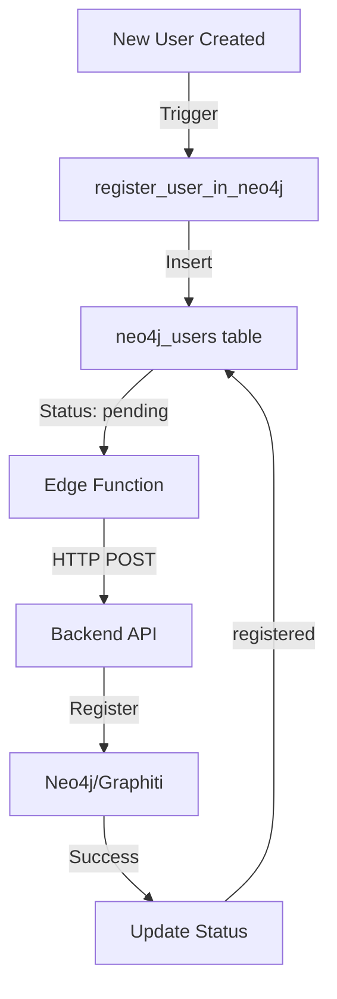

# Neo4j User Integration - Supabase Deployment Guide

## Overview

This document provides comprehensive instructions for deploying the Neo4j user integration to Supabase, which enables automatic user registration in the knowledge graph when new users are created.

## Deployment Status

### ✅ Completed Steps

1. **Edge Function Deployed** (register-neo4j-user)
   - Deployed to: `https://bpopugzfbokjzgawshov.supabase.co/functions/v1/register-neo4j-user`
   - Dashboard: https://supabase.com/dashboard/project/bpopugzfbokjzgawshov/functions
   - Environment Variable Set: `BACKEND_API_URL=https://marypause-ai.onrender.com`

2. **Project Linked**
   - Supabase Project: bpopugzfbokjzgawshov (MaryPause)
   - Region: East US (North Virginia)

### ⏳ Pending Steps

1. **Database Migration** - Needs to be executed in Supabase SQL Editor
2. **Integration Testing** - Verify end-to-end flow

## Database Migration Instructions

### Step 1: Open Supabase SQL Editor

Navigate to: https://supabase.com/dashboard/project/bpopugzfbokjzgawshov/sql

### Step 2: Execute Migration

Copy and paste the entire content from:
```
sql/migrations/003_neo4j_user_integration.sql
```

Or use the saved file at:
```
/tmp/neo4j_migration_bpopugzfbokjzgawshov.sql
```

### Step 3: Verify Migration Success

After running the migration, verify these objects were created:

```sql
-- Check if table exists
SELECT * FROM neo4j_users LIMIT 1;

-- Check if trigger exists
SELECT * FROM pg_trigger WHERE tgname = 'trigger_register_neo4j_user';

-- Check if functions exist
SELECT routine_name 
FROM information_schema.routines 
WHERE routine_name IN (
  'register_user_in_neo4j',
  'update_neo4j_registration_status',
  'get_pending_neo4j_registrations',
  'process_neo4j_registration'
);
```

## Edge Function Details

### Function Endpoint
```
POST https://bpopugzfbokjzgawshov.supabase.co/functions/v1/register-neo4j-user
```

### Request Format
```json
{
  "user_id": "uuid-of-user",
  "trigger_type": "single" // or "batch_process" for bulk processing
}
```

### Environment Variables
- `BACKEND_API_URL`: https://marypause-ai.onrender.com (already set)
- `SUPABASE_URL`: Automatically provided
- `SUPABASE_SERVICE_ROLE_KEY`: Automatically provided

## Testing Instructions

### 1. Test Edge Function Directly

Get your anon key from the Supabase dashboard and test:

```bash
curl -X POST https://bpopugzfbokjzgawshov.supabase.co/functions/v1/register-neo4j-user \
  -H 'Authorization: Bearer YOUR_ANON_KEY' \
  -H 'Content-Type: application/json' \
  -d '{"user_id": "test-123"}'
```

### 2. Test User Registration Flow

1. Create a new user in Supabase Auth:
   - Go to Authentication > Users in dashboard
   - Click "Add user"
   - Enter email and password

2. Check neo4j_users table:
   ```sql
   SELECT * FROM neo4j_users ORDER BY created_at DESC LIMIT 1;
   ```
   - Should show a record with status 'pending'

3. Manually trigger registration (if automatic trigger doesn't work):
   ```sql
   SELECT process_neo4j_registration('USER_ID_HERE');
   ```

### 3. Verify Backend Integration

Check if the backend API endpoint is accessible:
```bash
curl -X POST https://marypause-ai.onrender.com/api/users/register-neo4j \
  -H 'Content-Type: application/json' \
  -d '{"user_id": "test-user"}'
```

## Architecture Overview



## Database Schema

### neo4j_users Table
- `user_id`: UUID (FK to auth.users)
- `registration_status`: pending | registered | failed | retry
- `registered_at`: Timestamp of successful registration
- `last_attempt`: Last registration attempt timestamp
- `attempt_count`: Number of attempts made
- `last_error`: Last error message
- `created_at`: Record creation timestamp
- `updated_at`: Last update timestamp

### RLS Policies
- Service role: Full access
- Users: Can view their own registration status

## Troubleshooting

### Issue: Migration Not Applied
**Solution**: Ensure you're running the migration with service role permissions in the SQL Editor.

### Issue: Edge Function Not Triggering
**Solution**: Check if the trigger is properly created:
```sql
SELECT * FROM pg_trigger WHERE tgname = 'trigger_register_neo4j_user';
```

### Issue: Backend API Unreachable
**Solution**: Verify the backend is deployed and accessible:
```bash
curl https://marypause-ai.onrender.com/health
```

### Issue: Registration Stuck in Pending
**Solution**: Check Edge Function logs in Supabase dashboard and manually invoke:
```bash
supabase functions invoke register-neo4j-user --body '{"trigger_type": "batch_process"}'
```

## Rollback Instructions

If needed, rollback the migration:

```sql
BEGIN;
DROP TRIGGER IF EXISTS trigger_register_neo4j_user ON auth.users;
DROP TRIGGER IF EXISTS update_neo4j_users_updated_at ON neo4j_users;
DROP FUNCTION IF EXISTS register_user_in_neo4j() CASCADE;
DROP FUNCTION IF EXISTS update_neo4j_registration_status(UUID, TEXT, TEXT) CASCADE;
DROP FUNCTION IF EXISTS get_pending_neo4j_registrations() CASCADE;
DROP FUNCTION IF EXISTS process_neo4j_registration(UUID) CASCADE;
DROP FUNCTION IF EXISTS update_neo4j_users_updated_at() CASCADE;
DROP TABLE IF EXISTS neo4j_users CASCADE;
COMMIT;
```

## Next Steps

1. Execute the database migration in SQL Editor
2. Test user registration flow
3. Monitor Edge Function logs for any errors
4. Set up batch processing schedule if needed

## Support

For issues or questions:
- Check Edge Function logs: https://supabase.com/dashboard/project/bpopugzfbokjzgawshov/functions
- Review database logs: https://supabase.com/dashboard/project/bpopugzfbokjzgawshov/logs/postgres-logs
- Backend API status: https://marypause-ai.onrender.com/health